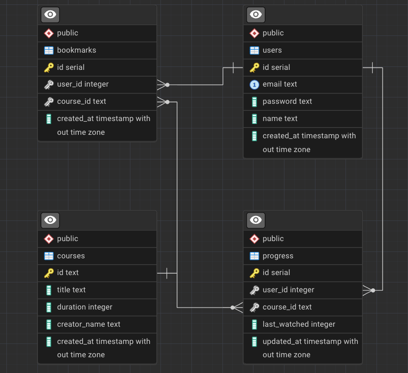

# API-Driven Learning Platform

A web application that integrates with external APIs to create a comprehensive learning experience. Students can search for learning resources, save content, and track their progress.

<a href="http://www.youtube.com/watch?feature=player_embedded&v=giwMG29te10" target="_blank">
 
</a>

## Table of Content

[Installation](#installation)

[Exploring the project](#exploring-the-project)

[API Design Philosophy](#api-design-philosophy)

[Future Improvements](#future-improvements)

---
# Installation
 There are 2 ways to run the project, each progressively tedious.
1. [Using the provided script](#using-the-provided-script)
2. [Manual Docker deployment](#manual-docker-deployment)


## Using the provided script
A bash script have been prepared for ease of getting it up and running. Make sure you have `Docker` installed on your system.
```bash
git pull https://github.com/therealproblem/API-Driven-Learning-Platform
cd API-Driven-Learning-Platform
./fresh-setup.sh
```

## Manual Docker deployment
This is the manual steps to setup using docker if the `fresh-setup.sh` script cannot be used.
1. Download & install `Docker` if you do now have it.
2. Pull the repo.
```bash
git pull https://github.com/therealproblem/API-Driven-Learning-Platform
```
3. At the root of the project folder make a copy of `users.example.yml` and rename it `users.yml`.
4. Get the containers up by running 
```bash
docker compose up -d --build
```
5. To generate the dummy data, use any HTTP Client, eg. Postman, to send a `POST` re	quest to  `http://localhost:3000/api/dummy/generate`. You will need internet for this step as the dummy data connects to the Youtube oembed API to collect video details.

---
# Exploring the project
1. Head on over to `http://localhost:5173` and login using the following credentials
```
username: test1@example.com
password: lxpUser1233!
```
2. If you wan to see the container logs in a friendlier way head on over to `http://localhost:8080` and login with
```
username: admin
password: password
```

---
# Tech Stack
Frontend: SvelteKit
Backend: Express.js
Database: Postgres
External API: Youtube Player API

## Considerations
The things that I would normally consider are as follows:
1. Scalability & Flexibility
   - How quickly the price scales with users?
   - How easy it is to deploy and maintain?
   - Performance in comparison to other alternatives
2. Time to Market & Availability
   - How quickly can a MVP be done?
   - Availability of developers if there’s a need to scale the development team
3. Community
   - Community determines availability of help when needed, and / or
   - Readily available plugins or components to use, cutting down development hours
With all of that in mind here’s the breakdown of the decisions made.

## SvelteKit
|           | Performance | Ease of Use | Community |
|-----------|-------------|-------------|-----------|
| SvelteKit | ✅          | ✅          | ❌       |
| React     | ❌          | ✅          | ✅       |
| Angular   | ❌          | ❌          | ✅       |
| Vue       | ❌          | ✅          | ❌       |

Disclaimer: Ease of use if very subjective. I’ve mainly worked on React, so only explored a little for Angular. 
Svelte excels in raw performance due to it’s compiled nature, not using virtual dom, and comes in a tiny bundle. On top of that, it is a full stack framework, albeit I only used it for front end in this case. This means that togther with similar frameworks like Next.js and Nuxt.js, it can handles SSR, CSR and hybrid, allowing developers to create SEO optimised sites.


## Express.js
|                   | Performance | Ease of Use | Community |
|-------------------|-------------|-------------|-----------|
| Node.js           | ✅           | ✅           | ✅         |
| ASP.NET           | ✅           | ❌           | ✅         |
| Python (Fast API) | ❌           | ✅           | ✅         |
| Go                | ✅           | ❌           | ❌         |
| PHP               | ❌           | ✅           | ✅         |

This is a tough choice for me, since I have extensive experience in developing in Node.js and ASP.NET backends. Go is the most performant out of all the options, but I decided not to pick it up for this project, partly is my lack of familarity with it. I knew using Node.js is going to eliminate a lot of development headaches will maintain the necessary performance and scalability. The huge community behind Node.js just make the decision a lot easier. There is nothing a middleware could not solve.


## Postgres
|          | Performance | Ease of Use | Community |
|----------|-------------|-------------|-----------|
| Postgres | ❌           | ✅           | ✅         |
| MSSQL    | ❌           | ❌           | ✅         |
| MySQL    | ❌           | ✅           | ✅         |
| NoSQL    | ✅           | ❌           | ❌         |

There is no doubt in terms of performance for NoSQL, like Redis, is the best, but it comes at the sacrifice of ACID compliance. In terms of scaling for future proofing future business needs, SQL is still a safer option. That brings us to a seemingly tie between Postgres and MySQL, but once again in terms of future proofing, Postgres is a clear winner. It is the database for data-intensive applications, complex analytical workloads, data warehousing, or when advanced features, strict SQL compliance, and robust data integrity are critical. It's well-suited for projects that anticipate future growth and require a highly extensible and powerful database.


## Conclusion
There is no single framework or language that excels across all use cases, which is one of the reasons microservices have become prevalent. For the current business requirements of this project, I have prioritized a faster time-to-market over maximum performance, accepting a slight trade-off in efficiency to meet delivery goals.

---
# API Design Philosophy
When designing the API i follow RESTful principles and aim for consistency and clarity. The API versioning are done using the `Accept` header so the API route itself does not change allowing minimal breaking changes in the future.
APIs and HTTP Methods are mapped to each resourse, for example, `/bookmarks`, `/courses`. APIs security is being handled by the `helmet.js` middleware to ensure common issues like XSS and MITM are managed properly. CORS is also enabled to only allow the selected domains specified in the `.env` are allowed to interact with the APIs.

## Entity Relationship Diagram


## Current implemented API
| API               | Method | Purpose                                          |
|-------------------|--------|--------------------------------------------------|
| /status           | GET    | Health check for the API                         |
| /user/register    | POST   | Register new users                               |
| /user/login       | POST   | Login existing users                             |
| /progress/update  | PUT    | Update video progress                            |
| /courses/list     | GET    | List all courses, paginated and filtered by text |
| /courses/id/:id   | GET    | Get details on one video                         |
| /bookmarks/list   | GET    | List all courses that the user have bookmarked   |
| /bookmarks/update | PUT    | Update the bookmark status of the course         |

## Youtube Player API
I’ve chosen to use the YouTube Player API because its structure and event-driven model are similar to handling SCORM content in educational platforms. This makes it easier to track user interactions, control playback, and integrate learning analytics in a familiar way. This API is also select based on reliability, documentation quality, and alignment with project requirements.

## Authentication Strategy
This project uses a JWT-based authentication strategy, with tokens stored in secure, HTTP-only cookies to manage and track user sessions. This approach ensures session data remains tamper-resistant, reduces the risk of token theft via client-side scripts, and supports a stateless architecture that simplifies scaling across multiple servers. Role based access control can be easily implemented off the current database design to allow different users to perform different actions on the platform. 

## APIs Failure
Due to project deadline limitations, currently there is minimal implmentation on this matter. I’ve included dozzle to help monitor errors in a friendly way. On the front end all API calls go through the `HttpClient` function, so that there is as centralised location for error logging and future improvements. For the backend, a middleware can be added to log the errors to a file which will be logrotate-d. Circuit breakers, cached responses and rate-limiting can be added to enchance system reliability and preventing cascading failures.

## Handling increased load
CDN can be used to cached static assets, Redis can handle frequently accessed responses and implementing load balancers for auto scaling resources based on necessary needs.

# Bottlenecks
Currently the project has not been load tested, so I am unable to truly pinpoint exactly which part of the system needs to be optimised, but optimising database and queries will always be the first thing to be looked at. Database can be indexed, and APIs with long query times will be logged to help with debugging at the later stage.

### Security Considerations
In addition to the API security measures discussed above, passwords are hashed before being stored in the database to protect against potential breaches. All traffic is enforced over HTTPS, and incoming data through the API is properly sanitized to prevent injection attacks.

---
# Future Improvements
Apart from the features that were left out mentioned, a couple more a worth mentioning:
1. Internationalization using the `Paraglide`
2. More robust unit and end to end testing with `Playwright`, `Vitest`, and `Jest`
3. Standardized error handling with standardize response interface
4. Server-side validation with `zod` within `Express.js`, instead of in the `SvelteKit` server or (even worse) on the client side, brings validation closer to the backend logic and allows for future API creation for public use.
5. Swagger file for APIs
